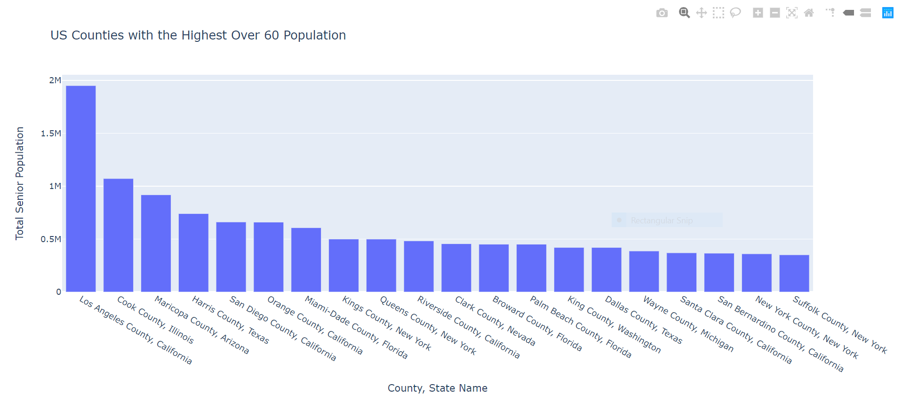
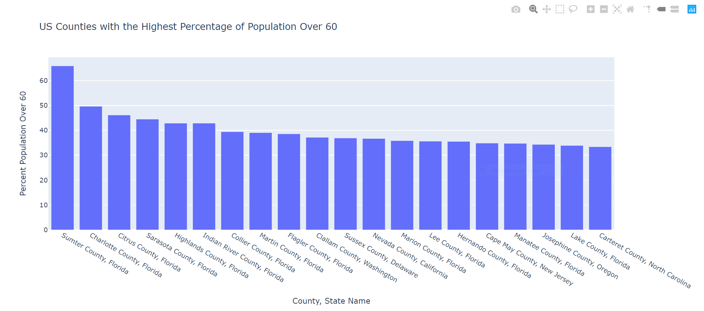
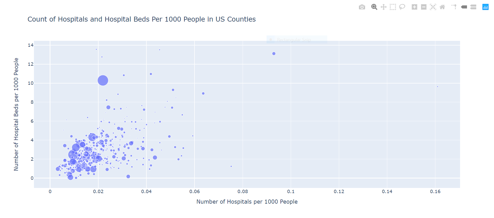
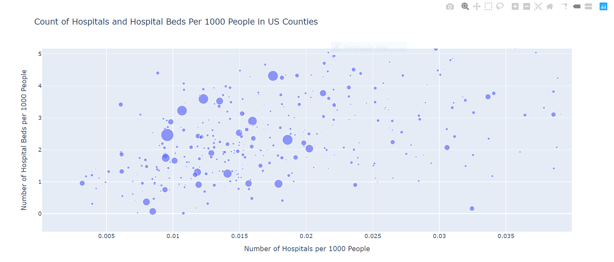
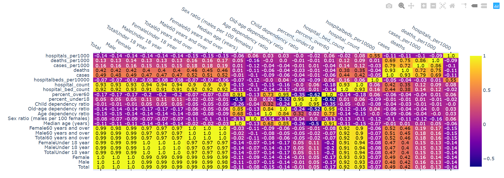

# Analyzing COVID-19 Preparedness and Risk Factors Across the U.S.

## Business Question
Placeholder copy

## Python Visualizations and Insights
All data from provided [Business Analytics GitHub repository](https://github.com/jhu-business-analytics/covid-19-case-python-data-analysis "COVID-19 Case Python Data Analysis Respository").

[Link to .ipynb file](https://drive.google.com/file/d/1vVlLRpT2Fv4mGToSR4xMI9btd_sS1wGQ/view?usp=sharing "Bowerman_Python1.ipynb").

### Age Distribution by County

These bar graphs show the twenty US counties with the highest number of residents 60 years or older and the highest percentage of residents 60 years or older, respectively. These graphs could help identify which counties may have the higher at-risk population, both in raw numbers and proportionally, for COVID-19 cases or deaths, assuming age is one of the most significant factors in suspectibility to the disease.

Interestingly, there is no crossover between the top 20 counties with the largest 60+ population and the top 20 with the highest percentage of 60+ residents. This may be a potential complication in decisions to distribute COVID-19 relief materials and funds: Which counties are more likely to be overwhelmed by cases? Those with more residents over 60 or those with a largest percentage of their residents over 60?

### Hospitals versus Hospital Beds versus COVID-19 Deaths per 1000 People

I created this visualization to see if there was any strong correlation between the number of hospitals (x-axis), hospital beds (y-axis), and COVID-19 deaths (size of bubble) per 1000 people. The very strong relationship between hospitals and hospital beds is evident. However, there doesn't seem to be an especially strong relationship between number of deaths and number of hospitals or hospital beds, as supported by the revised correlation heatmap I made below (Deaths per 1000 people has a correlation of -0.09 with number of hospitals and of 0.01 with hospital beds per 1000 people). This relationship, or lack thereof, is even more evident when you zoom in on the data, as seen below.

This convincingly demonstrates that the number of hospitals or hospital beds per 1000 people has not (thus far) been a strong predictor of the number of COVID-19 deaths per 1000 people across all US counties, indicating that there are potentially much more significant factors like social mobility, population density, number of daily travelers etc.

### Correlation Heatmap
A correlation I thought was interesting in the original heatmap was the 0.93 correlation between Number of Hospitals and Number of Hospital Beds, indicating, I think, that most hospitals across the country have a similar number of beds. This is makes me wonder if all hospitals have a similar capacity for beds and are currently at capacity, assuming that they don't have much, if any, room for more beds. If these are fair assumptions to make, that means that US hospitals could potentially all reach capacity at the same time, meaning we may see a severe peak in deaths if hospitals all have to begin turning people away at the same time.
